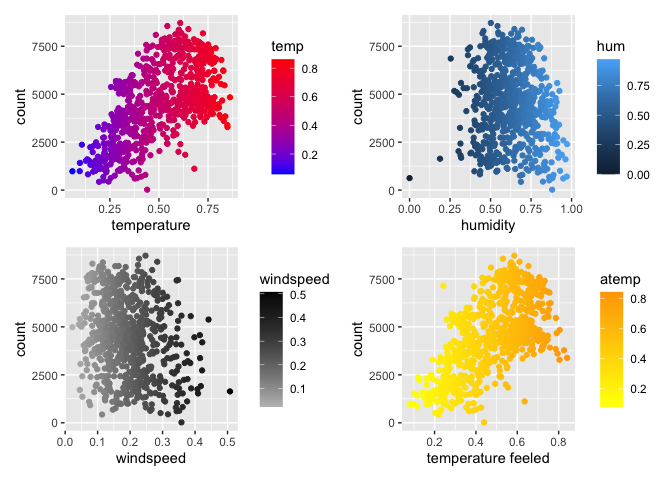

#### 1. IMPORT DATASET

This dataset contains the daily count of rental bikes between years 2011 and 2012 in Capital bikeshare system, which operates on some of the major cities of the State of Washington D.C, Virginia and Maryland.
The dataset is given by the Laboratory of Artificial Intelligence and Decision support of the University of Porto.

The main attributes : \

- $\textbf{instant}$ record index 
- $\textbf{dteday}$ : date 
- $\textbf{season}$ : 1 = spring, 2 = summer, 3 = fall, 4 = winter
- $\textbf{yr}$ : Year (0: 2011, 1:2012) 
- $\textbf{mnth}$ : Month ( 1 to 12) 
- $\textbf{holiday}$ : whether the day is considered a holiday or not
- $\textbf{workingday}$: if day is neither weekend nor holiday is 1, otherwise is 0
- $\textbf{weekday}$: day of the week 
- $\textbf{weathersit}$: Weather ( 1:Clear,2: Cloudy,3:Rain)
- $\textbf{temp}$: temperature in Celsius (normalized)
- $\textbf{atemp}$:"feels like" temperature in Celsius(normalized)
- $\textbf{hum}$: relative humidity
- $\textbf{windspeed}$: normalized wind speed.
- $\textbf{casual}$: count of casual users
- $\textbf{registered}$: count of registered users 
- $\textbf{cnt}$: count of total rental bikes including both casual and registered 


```r
day_data=read_csv('/Users/gabrielecola/GLM_BikeSharing/Data/bike_rental.csv')
```


```r
head(day_data)
```

```
## # A tibble: 6 × 16
##   instant dteday     season    yr  mnth holiday weekday workingday weathersit
##     <dbl> <date>      <dbl> <dbl> <dbl>   <dbl>   <dbl>      <dbl>      <dbl>
## 1       1 2011-01-01      1     0     1       0       6          0          2
## 2       2 2011-01-02      1     0     1       0       0          0          2
## 3       3 2011-01-03      1     0     1       0       1          1          1
## 4       4 2011-01-04      1     0     1       0       2          1          1
## 5       5 2011-01-05      1     0     1       0       3          1          1
## 6       6 2011-01-06      1     0     1       0       4          1          1
## # ℹ 7 more variables: temp <dbl>, atemp <dbl>, hum <dbl>, windspeed <dbl>,
## #   casual <dbl>, registered <dbl>, cnt <dbl>
```


```r
summary(day_data)
```

```
##     instant          dteday               season            yr        
##  Min.   :  1.0   Min.   :2011-01-01   Min.   :1.000   Min.   :0.0000  
##  1st Qu.:183.5   1st Qu.:2011-07-02   1st Qu.:2.000   1st Qu.:0.0000  
##  Median :366.0   Median :2012-01-01   Median :3.000   Median :1.0000  
##  Mean   :366.0   Mean   :2012-01-01   Mean   :2.497   Mean   :0.5007  
##  3rd Qu.:548.5   3rd Qu.:2012-07-01   3rd Qu.:3.000   3rd Qu.:1.0000  
##  Max.   :731.0   Max.   :2012-12-31   Max.   :4.000   Max.   :1.0000  
##       mnth          holiday           weekday        workingday   
##  Min.   : 1.00   Min.   :0.00000   Min.   :0.000   Min.   :0.000  
##  1st Qu.: 4.00   1st Qu.:0.00000   1st Qu.:1.000   1st Qu.:0.000  
##  Median : 7.00   Median :0.00000   Median :3.000   Median :1.000  
##  Mean   : 6.52   Mean   :0.02873   Mean   :2.997   Mean   :0.684  
##  3rd Qu.:10.00   3rd Qu.:0.00000   3rd Qu.:5.000   3rd Qu.:1.000  
##  Max.   :12.00   Max.   :1.00000   Max.   :6.000   Max.   :1.000  
##    weathersit         temp             atemp              hum        
##  Min.   :1.000   Min.   :0.05913   Min.   :0.07907   Min.   :0.0000  
##  1st Qu.:1.000   1st Qu.:0.33708   1st Qu.:0.33784   1st Qu.:0.5200  
##  Median :1.000   Median :0.49833   Median :0.48673   Median :0.6267  
##  Mean   :1.395   Mean   :0.49538   Mean   :0.47435   Mean   :0.6279  
##  3rd Qu.:2.000   3rd Qu.:0.65542   3rd Qu.:0.60860   3rd Qu.:0.7302  
##  Max.   :3.000   Max.   :0.86167   Max.   :0.84090   Max.   :0.9725  
##    windspeed           casual         registered        cnt      
##  Min.   :0.02239   Min.   :   2.0   Min.   :  20   Min.   :  22  
##  1st Qu.:0.13495   1st Qu.: 315.5   1st Qu.:2497   1st Qu.:3152  
##  Median :0.18097   Median : 713.0   Median :3662   Median :4548  
##  Mean   :0.19049   Mean   : 848.2   Mean   :3656   Mean   :4504  
##  3rd Qu.:0.23321   3rd Qu.:1096.0   3rd Qu.:4776   3rd Qu.:5956  
##  Max.   :0.50746   Max.   :3410.0   Max.   :6946   Max.   :8714
```


#### 2. PRE-PROCESSING 

###### 2.1 CHECKING THE MISSING  VALUE


```r
sum(is.na(day_data))
```

```
## [1] 0
```


###### 2.2 ENCODING VARIABLE

We encode some variables as factors because initially they are encoded as dbl for practical reason so we reestablish the correct type of them.


```r
cols <- c("season", "yr", "weathersit", "workingday",'holiday','mnth','weekday')


new_data<-day_data %>%
       mutate_each_(funs(factor(.)),cols)

glimpse(new_data)
```

```
## Rows: 731
## Columns: 16
## $ instant    <dbl> 1, 2, 3, 4, 5, 6, 7, 8, 9, 10, 11, 12, 13, 14, 15, 16, 17, …
## $ dteday     <date> 2011-01-01, 2011-01-02, 2011-01-03, 2011-01-04, 2011-01-05…
## $ season     <fct> 1, 1, 1, 1, 1, 1, 1, 1, 1, 1, 1, 1, 1, 1, 1, 1, 1, 1, 1, 1,…
## $ yr         <fct> 0, 0, 0, 0, 0, 0, 0, 0, 0, 0, 0, 0, 0, 0, 0, 0, 0, 0, 0, 0,…
## $ mnth       <fct> 1, 1, 1, 1, 1, 1, 1, 1, 1, 1, 1, 1, 1, 1, 1, 1, 1, 1, 1, 1,…
## $ holiday    <fct> 0, 0, 0, 0, 0, 0, 0, 0, 0, 0, 0, 0, 0, 0, 0, 0, 1, 0, 0, 0,…
## $ weekday    <fct> 6, 0, 1, 2, 3, 4, 5, 6, 0, 1, 2, 3, 4, 5, 6, 0, 1, 2, 3, 4,…
## $ workingday <fct> 0, 0, 1, 1, 1, 1, 1, 0, 0, 1, 1, 1, 1, 1, 0, 0, 0, 1, 1, 1,…
## $ weathersit <fct> 2, 2, 1, 1, 1, 1, 2, 2, 1, 1, 2, 1, 1, 1, 2, 1, 2, 2, 2, 2,…
## $ temp       <dbl> 0.3441670, 0.3634780, 0.1963640, 0.2000000, 0.2269570, 0.20…
## $ atemp      <dbl> 0.3636250, 0.3537390, 0.1894050, 0.2121220, 0.2292700, 0.23…
## $ hum        <dbl> 0.805833, 0.696087, 0.437273, 0.590435, 0.436957, 0.518261,…
## $ windspeed  <dbl> 0.1604460, 0.2485390, 0.2483090, 0.1602960, 0.1869000, 0.08…
## $ casual     <dbl> 331, 131, 120, 108, 82, 88, 148, 68, 54, 41, 43, 25, 38, 54…
## $ registered <dbl> 654, 670, 1229, 1454, 1518, 1518, 1362, 891, 768, 1280, 122…
## $ cnt        <dbl> 985, 801, 1349, 1562, 1600, 1606, 1510, 959, 822, 1321, 126…
```


#### 3. EDA

$HeatMap$ \
We use a heatmap to see clearly the correlation matrix: \
1. $temp$ and $atemp$ are high correllated , close to 1 so we can remove it one of them. \
2. $Registered$/ $Casual$ and $Count$ are highly correlated which indicates that most of the bikes that are rented are registered , one of them we can eliminate.


```r
new_data2<- new_data %>% dplyr:: select(-season,-yr,-weathersit,-workingday,-holiday,-mnth,-weekday,-dteday)
cor_matrix<-cor(new_data2)
corrplot(cor_matrix, method="number",tl.cex=0.5,number.digits = 1)
```

<!-- -->

$Scatterplot$ \
1. $Temperature$ are positively correlated with $Count$, if $Temperature$ rise also $Count$.\
2. $WindSpeed$ are negatively correlated with $Count$, if $Wind$ rise  $Count$ will diminish.\
3. $Temperature \ feeling$ follows the same pattern of $Temperature$ , because they are highly correlated.


```r
temp_scatter<-ggplot(new_data, aes(x=temp, y=cnt)) +
  geom_jitter(aes(colour = temp,width = 0.15))+
  scale_color_gradient(low="blue", high="red")+
  xlab('temperature')+
  ylab('count')

humidity_scatter<-ggplot(new_data, aes(x=hum, y=cnt)) +
  geom_jitter(aes(colour = hum))+
  xlab('humidity')+
  ylab('count')

windspeed_scatter<-ggplot(new_data, aes(x=windspeed, y=cnt)) +
  geom_jitter(aes(colour=windspeed))+
  scale_color_gradient(low="grey", high="black")+
  xlab('windspeed')+
  ylab('count')
  

atemp_scatter<-ggplot(new_data, aes(x=atemp, y=cnt)) +
  geom_jitter(aes(colour=atemp))+
  scale_color_gradient(low="yellow", high="orange")+
  xlab('temperature feeled')+
  ylab('count')
  
  
temp_scatter+humidity_scatter+windspeed_scatter+atemp_scatter
```

<!-- -->

Here we create a Dataframe that reports the total count for each $weathersit$.


```r
data_weather<-new_data  %>% group_by(weathersit) %>% distinct(weathersit,cnt) %>% summarize(count=sum(cnt)) %>% arrange(desc(count))

glimpse(data_weather)
```

```
## Rows: 3
## Columns: 2
## $ weathersit <fct> 1, 2, 3
## $ count      <dbl> 2194133, 984804, 37869
```

In this two graph we want to analyze the variable $weathersit$, firstly with geom_bar so we look to the frequency of each $weathersit$,and then with geom_col to see the overall count for each $weathersit$.


```r
j<-ggplot() + geom_col(data =data_weather, aes(x = weathersit, y = count,fill=weathersit))+
  scale_fill_discrete(name = "weathersit")+
  xlab('Weathersit')+
  labs(title = "The total count for each Weather ", caption = "1: Sunny,2: Cloudy,3:Rainy")
  
m<-ggplot(data = new_data) +
  geom_bar(mapping = aes(x = weathersit,fill=weathersit))+
  scale_fill_discrete(name = "weathersit")+
  xlab('Weathersit')+
  labs(title = "Bar chart ", caption = "1: Sunny,2: Cloudy,3:Rainy")

m+j
```

<!-- -->

Now our focus is on variable $Season$,so we decide to choose a boxplot for each $Season$.
We have observed that the highest median is registered in Summer and followed by Spring.
Furthermore, we spot that there is an outlier in $Winter$ that may be caused by a very hot day where people used bikes, and also another one in Fall, where there is a day with 0 count.


```r
ggplot(aes(x=season,y = cnt),data=new_data)+geom_boxplot(aes(fill=season)) + theme_bw()+
  xlab('Season')+
  ylab('Count')+
  scale_fill_discrete(name = "season")+
  labs(title = "Boxplot of Season ", caption = "1: Winter,2: Spring,3:Summer,4:Fall")
```

<!-- -->


We want to see the Trends across the $Year$ 2011 and 2012, in order to spot the peaks and downs of each $month$ per $Year$.
In 2011 we notice that with the beginning of spring and summer the $count$ of the bike has increased while with the incoming of autumn/winter the trend has decreased, same thing in 2012.
Furthermore, we notice the in 2012 the trend has increased so much rather than 2011.


```r
ggplot(data = new_data, aes(mnth, cnt)) +
  geom_line(color = "steelblue") +
  geom_point(color="steelblue") +
  xlab('Month')+
  ylab('Count')+
  facet_wrap(~yr)+
    labs(title = "Trend ", caption = "0: 2011,1: 2012")
```

<!-- -->


In this graph we analyze in depth the variable $Holiday$, firstly with a bar chart in order to
understand if the bike are rented more in holiday or not and we notice that people do not prefer using it
on holiday days.


```r
ggplot(data = new_data) +
  geom_bar(mapping = aes(x = holiday,fill=holiday))+
  scale_fill_discrete(name = "holiday")+
  xlab('holiday')
```

<!-- -->

Furthermore, with the second graph we spot that during the weekend there are the most peaks of renting bikes, while when there is holiday we have few data so we cannot draw a conclusion.


```r
ggplot(data = new_data, aes(weekday, cnt)) +
  geom_line(color = "steelblue") +
  geom_point(color="steelblue") +
  xlab('Day')+
  ylab('Count')+
  facet_wrap(~holiday)+
    labs(title = "Trend ", caption = "0: Sunday,1: Monday,2: Tuesday,3:Wednesday,4:Thursday,5:Friday,6:Saturday")
```

<!-- -->

To see how our $Y$ is distributed in order to choose which models we have to applied, we notice that the
variable $cnt$ is distributed like a Normal, and we know that even if our Y is count but if it is large enough it can be approximately ~ N.


```r
ggplot(new_data, aes(x=cnt))+
  geom_histogram(color="darkblue", fill="lightblue",bins=30)+
  geom_vline(aes(xintercept=mean(cnt)),
            color="blue", linetype="dashed", size=1)
```

<!-- -->


### 4. Feature Engineering

1. As wee see in Correlation matrix, we can delete $casual$ or $registered$.
2. We remove $atemp$  because is highly correllated with $temp$
3. We remove $dteday$ because is not useful
4. We remove $workingday$ because gives the same information of $weekdays$


```r
new_data5<- new_data %>% dplyr:: select(-casual,-atemp,-dteday,-workingday)
glimpse(new_data5)
```

```
## Rows: 731
## Columns: 12
## $ instant    <dbl> 1, 2, 3, 4, 5, 6, 7, 8, 9, 10, 11, 12, 13, 14, 15, 16, 17, …
## $ season     <fct> 1, 1, 1, 1, 1, 1, 1, 1, 1, 1, 1, 1, 1, 1, 1, 1, 1, 1, 1, 1,…
## $ yr         <fct> 0, 0, 0, 0, 0, 0, 0, 0, 0, 0, 0, 0, 0, 0, 0, 0, 0, 0, 0, 0,…
## $ mnth       <fct> 1, 1, 1, 1, 1, 1, 1, 1, 1, 1, 1, 1, 1, 1, 1, 1, 1, 1, 1, 1,…
## $ holiday    <fct> 0, 0, 0, 0, 0, 0, 0, 0, 0, 0, 0, 0, 0, 0, 0, 0, 1, 0, 0, 0,…
## $ weekday    <fct> 6, 0, 1, 2, 3, 4, 5, 6, 0, 1, 2, 3, 4, 5, 6, 0, 1, 2, 3, 4,…
## $ weathersit <fct> 2, 2, 1, 1, 1, 1, 2, 2, 1, 1, 2, 1, 1, 1, 2, 1, 2, 2, 2, 2,…
## $ temp       <dbl> 0.3441670, 0.3634780, 0.1963640, 0.2000000, 0.2269570, 0.20…
## $ hum        <dbl> 0.805833, 0.696087, 0.437273, 0.590435, 0.436957, 0.518261,…
## $ windspeed  <dbl> 0.1604460, 0.2485390, 0.2483090, 0.1602960, 0.1869000, 0.08…
## $ registered <dbl> 654, 670, 1229, 1454, 1518, 1518, 1362, 891, 768, 1280, 122…
## $ cnt        <dbl> 985, 801, 1349, 1562, 1600, 1606, 1510, 959, 822, 1321, 126…
```

### 5. Model


```r
set.seed(123)
split.bike<-initial_split(new_data5,0.7)
train.bike<-training(split.bike)
test.bike<-testing(split.bike)
```

#### 5.1 POISSON MODEL 

We adopt for a Poisson model because $Y$ is count, but when we look at the summary we spot that there
is big difference between residual deviance and degrees of freedom so probably it is caused by overdispersion.
However, count data  are often overdispersed.This violates the assumption of a Poisson GLM, so our model
has understimated the standard errors, which has resulted in too low p-values.


```r
pois_mod<- glm(cnt~.,data=train.bike,family='poisson')
summary(pois_mod)
```

```
## 
## Call:
## glm(formula = cnt ~ ., family = "poisson", data = train.bike)
## 
## Deviance Residuals: 
##     Min       1Q   Median       3Q      Max  
## -42.572   -4.633    0.787    4.464   24.581  
## 
## Coefficients:
##               Estimate Std. Error  z value Pr(>|z|)    
## (Intercept)  7.327e+00  6.481e-03 1130.437   <2e-16 ***
## instant     -1.694e-03  7.863e-05  -21.536   <2e-16 ***
## season2      9.772e-02  4.538e-03   21.533   <2e-16 ***
## season3      1.106e-01  5.183e-03   21.334   <2e-16 ***
## season4      1.050e-01  5.301e-03   19.811   <2e-16 ***
## yr1          5.880e-01  2.892e-02   20.336   <2e-16 ***
## mnth2        1.049e-01  4.918e-03   21.329   <2e-16 ***
## mnth3        2.016e-01  6.866e-03   29.359   <2e-16 ***
## mnth4        2.251e-01  9.624e-03   23.393   <2e-16 ***
## mnth5        2.312e-01  1.187e-02   19.475   <2e-16 ***
## mnth6        2.183e-01  1.382e-02   15.803   <2e-16 ***
## mnth7        2.389e-01  1.590e-02   15.021   <2e-16 ***
## mnth8        2.900e-01  1.800e-02   16.114   <2e-16 ***
## mnth9        3.214e-01  1.987e-02   16.174   <2e-16 ***
## mnth10       4.558e-01  2.189e-02   20.816   <2e-16 ***
## mnth11       5.390e-01  2.409e-02   22.377   <2e-16 ***
## mnth12       5.437e-01  2.621e-02   20.744   <2e-16 ***
## holiday1     1.422e-01  5.020e-03   28.322   <2e-16 ***
## weekday1    -2.201e-01  2.922e-03  -75.314   <2e-16 ***
## weekday2    -2.395e-01  2.950e-03  -81.199   <2e-16 ***
## weekday3    -2.822e-01  3.053e-03  -92.429   <2e-16 ***
## weekday4    -2.608e-01  3.013e-03  -86.537   <2e-16 ***
## weekday5    -2.141e-01  2.949e-03  -72.587   <2e-16 ***
## weekday6     2.556e-02  2.542e-03   10.057   <2e-16 ***
## weathersit2 -1.841e-03  1.845e-03   -0.998    0.318    
## weathersit3 -2.973e-01  6.755e-03  -44.019   <2e-16 ***
## temp         5.058e-01  1.029e-02   49.152   <2e-16 ***
## hum         -6.135e-02  7.089e-03   -8.653   <2e-16 ***
## windspeed   -2.249e-01  1.007e-02  -22.327   <2e-16 ***
## registered   2.618e-04  1.235e-06  211.956   <2e-16 ***
## ---
## Signif. codes:  0 '***' 0.001 '**' 0.01 '*' 0.05 '.' 0.1 ' ' 1
## 
## (Dispersion parameter for poisson family taken to be 1)
## 
##     Null deviance: 447388  on 510  degrees of freedom
## Residual deviance:  31295  on 481  degrees of freedom
## AIC: 36532
## 
## Number of Fisher Scoring iterations: 4
```


```r
exp(coef(pois_mod))
```

```
##  (Intercept)      instant      season2      season3      season4          yr1 
## 1520.4351444    0.9983079    1.1026593    1.1169112    1.1107208    1.8004509 
##        mnth2        mnth3        mnth4        mnth5        mnth6        mnth7 
##    1.1105862    1.2233183    1.2524869    1.2600995    1.2440015    1.2698229 
##        mnth8        mnth9       mnth10       mnth11       mnth12     holiday1 
##    1.3364209    1.3790329    1.5773674    1.7143452    1.7224236    1.1527956 
##     weekday1     weekday2     weekday3     weekday4     weekday5     weekday6 
##    0.8024540    0.7869945    0.7541458    0.7704620    0.8072818    1.0258930 
##  weathersit2  weathersit3         temp          hum    windspeed   registered 
##    0.9981607    0.7428000    1.6582581    0.9404974    0.7985690    1.0002618
```

#### 5.1.1 DIAGNOSTIC OF THE MODEL

Before we try to spot if there is **overdispersion** or not , we firstly check the goodness of fit and we have
to reject the $H_{0}$ , so our model doesn't fit data well.


```r
#probability to observed extreme value of deviance that we observed
1-pchisq(pois_mod$deviance,pois_mod$df.residual)
```

```
## [1] 0
```

There are two ways to check overdispersion: \
1.The Pearson $\chi^2$ dispersion statistic \
2. Plot the approximations of Mean vs Variance  \

$The \ Pearson$ $\chi^2$ $dispersion\ statistic$

Firstly, we do an overdispersion test to check if there is any presence of overdispersion and we notice that $\phi$, the dispersion parameter, is far away from 1, so there is a great problem of overdispersion.


```r
P__disp(pois_mod)
```

```
## pearson.chi2   dispersion 
##  29154.84267     60.61298
```

$Plot\ Mean\ vs \ Variance$ \
We want to check if the assumption of $\mu$ = $\sigma^2$, so if they are equal they should stand in that following line.
We notice that there is a systematic variation that line then it means that there is a hidden relationship between variance and expectation.


```r
#Check if mean is equal to variance
#approximate the expected value with your predicted
E_hat=predict(pois_mod,type="response")
# response directly give the lambda
# what you observed and the expected value
V_hat=(train.bike$cnt-E_hat)^2
# the log shift ups because the product of log is the sum of log
plot(log(E_hat),log(V_hat))
abline(0,1)
```

<!-- -->

$Outlier$ \
Furthermore, we try to detect some $outlier$ to see if it can also cause some troubles to the model and
we spot the observation 193 of training set but it don't seem to be a real outlier because it is  a low count but in winter so we would expect it, so it  not probably the cause.


```r
# we make an half normal plot of studentized residuals 
halfnorm(rstudent(pois_mod))
```

<!-- -->


```r
# we want  see the value of count of that observation
train.bike$cnt[193]
```

```
## [1] 22
```


```r
#inspect the see the feature of that particular observation
train.bike %>% filter(cnt==22)
```

```
## # A tibble: 1 × 12
##   instant season yr    mnth  holiday weekday weathersit  temp   hum windspeed
##     <dbl> <fct>  <fct> <fct> <fct>   <fct>   <fct>      <dbl> <dbl>     <dbl>
## 1     668 4      1     10    0       1       3           0.44  0.88     0.358
## # ℹ 2 more variables: registered <dbl>, cnt <dbl>
```

#### 5.1.2 Predictions


```r
predictions_pois<- predict(pois_mod,newdata=test.bike,type='response')
MSE_pois<- MSE(predictions_pois,test.bike$cnt)
RMSE_pois<- sqrt(MSE_pois)
RMSE_pois
```

```
## [1] 499.7525
```


There are two main approaches that we can take to deal with over-dispersed count data in GLMs: \

1. Fit a quasi-Poisson GLM \
2. Fit a negative binomial GLM

#### 5.2 Quasi Poisson

We have to deal with $overdispersion$,so we adopted the Quasi Poisson model that will result in the same coefficients as The Poisson model  but with different Standard errors and p-values thanks to his dispersion  parameter $\phi$, that tells how much the variance linearly changes in relation to the mean.
Furthermore, we can’t obtain an AIC value for quasi-Poisson models, because these models use quasi-likelihood rather than true likelihood.


```r
quasipois_mod<- glm(cnt~.,data=train.bike,family=quasipoisson)
summary(quasipois_mod)
```

```
## 
## Call:
## glm(formula = cnt ~ ., family = quasipoisson, data = train.bike)
## 
## Deviance Residuals: 
##     Min       1Q   Median       3Q      Max  
## -42.572   -4.633    0.787    4.464   24.581  
## 
## Coefficients:
##               Estimate Std. Error t value Pr(>|t|)    
## (Intercept)  7.327e+00  5.046e-02 145.199  < 2e-16 ***
## instant     -1.694e-03  6.122e-04  -2.766 0.005889 ** 
## season2      9.772e-02  3.533e-02   2.766 0.005896 ** 
## season3      1.106e-01  4.035e-02   2.740 0.006367 ** 
## season4      1.050e-01  4.127e-02   2.545 0.011252 *  
## yr1          5.880e-01  2.251e-01   2.612 0.009281 ** 
## mnth2        1.049e-01  3.829e-02   2.740 0.006381 ** 
## mnth3        2.016e-01  5.345e-02   3.771 0.000183 ***
## mnth4        2.251e-01  7.493e-02   3.005 0.002798 ** 
## mnth5        2.312e-01  9.242e-02   2.501 0.012699 *  
## mnth6        2.183e-01  1.076e-01   2.030 0.042922 *  
## mnth7        2.389e-01  1.238e-01   1.929 0.054266 .  
## mnth8        2.900e-01  1.401e-01   2.070 0.039009 *  
## mnth9        3.214e-01  1.547e-01   2.077 0.038293 *  
## mnth10       4.558e-01  1.705e-01   2.674 0.007757 ** 
## mnth11       5.390e-01  1.875e-01   2.874 0.004230 ** 
## mnth12       5.437e-01  2.041e-01   2.664 0.007969 ** 
## holiday1     1.422e-01  3.909e-02   3.638 0.000305 ***
## weekday1    -2.201e-01  2.275e-02  -9.674  < 2e-16 ***
## weekday2    -2.395e-01  2.297e-02 -10.430  < 2e-16 ***
## weekday3    -2.822e-01  2.377e-02 -11.872  < 2e-16 ***
## weekday4    -2.608e-01  2.346e-02 -11.115  < 2e-16 ***
## weekday5    -2.141e-01  2.296e-02  -9.323  < 2e-16 ***
## weekday6     2.556e-02  1.979e-02   1.292 0.197040    
## weathersit2 -1.841e-03  1.436e-02  -0.128 0.898044    
## weathersit3 -2.973e-01  5.259e-02  -5.654 2.69e-08 ***
## temp         5.058e-01  8.011e-02   6.313 6.21e-10 ***
## hum         -6.135e-02  5.519e-02  -1.111 0.266918    
## windspeed   -2.249e-01  7.843e-02  -2.868 0.004315 ** 
## registered   2.618e-04  9.616e-06  27.225  < 2e-16 ***
## ---
## Signif. codes:  0 '***' 0.001 '**' 0.01 '*' 0.05 '.' 0.1 ' ' 1
## 
## (Dispersion parameter for quasipoisson family taken to be 60.61307)
## 
##     Null deviance: 447388  on 510  degrees of freedom
## Residual deviance:  31295  on 481  degrees of freedom
## AIC: NA
## 
## Number of Fisher Scoring iterations: 4
```

As we notice, there is still a big difference between residual Deviance and degrees of freedom.
From the dispersion test we spot that there is a severe dispersion, so probably we have to adopt a 
Negative Binomial model.
Furthermore, we have to guess that there is non linear relationship between the variance and the mean,
therefore the quasi Poisson model would not be appropriate because it assumes that the variance increases linearly as a function of the mean.

#### 5.2.1 Predictions


```r
predictions_quasipois<- predict(quasipois_mod,newdata=test.bike,type='response')
MSE_quasipois<- MSE(predictions_quasipois,test.bike$cnt)
RMSE_quasipois<- sqrt(MSE_quasipois)
RMSE_quasipois
```

```
## [1] 499.7525
```


#### 5.3 Negative  Binomial

The Negative Binomial is Poisson regression model with an extra parameter $\theta$, which may account for overdispersion. \
$Var=\mu+\frac{\mu^2}{\theta}$ \
In comparison to The Quasi-Poisson regression model, the negative binomial models assumes that the variance can increase by the square of the mean.


```r
negative_bin <- glm.nb(cnt ~., data=train.bike)
summary(negative_bin)
```

```
## 
## Call:
## glm.nb(formula = cnt ~ ., data = train.bike, init.theta = 35.71510935, 
##     link = log)
## 
## Deviance Residuals: 
##      Min        1Q    Median        3Q       Max  
## -12.1652   -0.4451    0.0553    0.4514    2.9309  
## 
## Coefficients:
##               Estimate Std. Error z value Pr(>|z|)    
## (Intercept)  7.195e+00  6.471e-02 111.189  < 2e-16 ***
## instant     -2.449e-03  8.797e-04  -2.784  0.00537 ** 
## season2      9.978e-02  4.803e-02   2.077  0.03777 *  
## season3      1.110e-01  5.777e-02   1.921  0.05473 .  
## season4      5.825e-02  5.116e-02   1.139  0.25483    
## yr1          8.248e-01  3.239e-01   2.547  0.01088 *  
## mnth2        1.361e-01  4.478e-02   3.039  0.00238 ** 
## mnth3        2.235e-01  6.923e-02   3.228  0.00125 ** 
## mnth4        2.560e-01  1.011e-01   2.531  0.01136 *  
## mnth5        2.629e-01  1.266e-01   2.076  0.03785 *  
## mnth6        2.440e-01  1.501e-01   1.626  0.10395    
## mnth7        3.069e-01  1.760e-01   1.743  0.08126 .  
## mnth8        3.675e-01  2.000e-01   1.838  0.06605 .  
## mnth9        4.562e-01  2.209e-01   2.065  0.03894 *  
## mnth10       6.539e-01  2.493e-01   2.623  0.00872 ** 
## mnth11       7.948e-01  2.744e-01   2.897  0.00377 ** 
## mnth12       8.088e-01  2.978e-01   2.716  0.00660 ** 
## holiday1     1.370e-01  5.114e-02   2.679  0.00739 ** 
## weekday1    -2.310e-01  3.109e-02  -7.429 1.09e-13 ***
## weekday2    -2.499e-01  3.198e-02  -7.814 5.53e-15 ***
## weekday3    -2.932e-01  3.268e-02  -8.973  < 2e-16 ***
## weekday4    -2.611e-01  3.232e-02  -8.080 6.46e-16 ***
## weekday5    -2.201e-01  3.244e-02  -6.784 1.17e-11 ***
## weekday6     9.196e-03  2.832e-02   0.325  0.74544    
## weathersit2  4.643e-03  2.071e-02   0.224  0.82263    
## weathersit3 -3.362e-01  5.526e-02  -6.084 1.18e-09 ***
## temp         6.160e-01  1.126e-01   5.470 4.49e-08 ***
## hum         -6.077e-02  7.572e-02  -0.803  0.42224    
## windspeed   -2.904e-01  1.094e-01  -2.655  0.00794 ** 
## registered   3.052e-04  1.296e-05  23.542  < 2e-16 ***
## ---
## Signif. codes:  0 '***' 0.001 '**' 0.01 '*' 0.05 '.' 0.1 ' ' 1
## 
## (Dispersion parameter for Negative Binomial(35.7151) family taken to be 1)
## 
##     Null deviance: 4478.33  on 510  degrees of freedom
## Residual deviance:  540.28  on 481  degrees of freedom
## AIC: 8197.4
## 
## Number of Fisher Scoring iterations: 1
## 
## 
##               Theta:  35.72 
##           Std. Err.:  2.35 
## 
##  2 x log-likelihood:  -8135.372
```

We notice that the distance between Residual Deviance and degrees of freedom has been reduce so much.

#### 5.3.1 MODEL SELECTION
We want to choose the model with lower AIC and possibly less feature in order to have a simpler method
so we compute the function step.
After computed it, we notice that we can remove variable $holiday$. \
Furthermore, we want to spot if there any differences between the model with holiday and without it so we
compute anova and we notice that the models have no differences.


```r
final_model<-step(negative_bin)
```

```
## Start:  AIC=8195.37
## cnt ~ instant + season + yr + mnth + holiday + weekday + weathersit + 
##     temp + hum + windspeed + registered
## 
##              Df Deviance    AIC
## - hum         1   540.88 8194.0
## - season      3   545.32 8194.4
## <none>            540.28 8195.4
## - yr          1   546.76 8199.9
## - windspeed   1   547.27 8200.4
## - holiday     1   547.52 8200.6
## - instant     1   548.00 8201.1
## - mnth       11   572.78 8205.9
## - temp        1   569.98 8223.1
## - weathersit  2   585.11 8236.2
## - weekday     6   697.83 8340.9
## - registered  1  1026.38 8679.5
## 
## Step:  AIC=8193.98
## cnt ~ instant + season + yr + mnth + holiday + weekday + weathersit + 
##     temp + windspeed + registered
## 
##              Df Deviance    AIC
## - season      3   545.13 8192.9
## <none>            540.21 8194.0
## - windspeed   1   546.59 8198.4
## - yr          1   546.88 8198.6
## - holiday     1   547.72 8199.5
## - instant     1   548.13 8199.9
## - mnth       11   572.78 8204.5
## - temp        1   569.82 8221.6
## - weathersit  2   589.27 8239.0
## - weekday     6   698.40 8340.2
## - registered  1  1032.96 8684.7
## 
## Step:  AIC=8192.87
## cnt ~ instant + yr + mnth + holiday + weekday + weathersit + 
##     temp + windspeed + registered
## 
##              Df Deviance    AIC
## <none>            539.84 8192.9
## - yr          1   545.80 8196.8
## - windspeed   1   546.43 8197.5
## - instant     1   547.19 8198.2
## - holiday     1   547.97 8199.0
## - temp        1   568.86 8219.9
## - mnth       11   591.99 8223.0
## - weathersit  2   585.86 8234.9
## - weekday     6   713.90 8354.9
## - registered  1  1155.34 8806.4
```


```r
final_model
```

```
## 
## Call:  glm.nb(formula = cnt ~ instant + yr + mnth + holiday + weekday + 
##     weathersit + temp + windspeed + registered, data = train.bike, 
##     init.theta = 35.29940702, link = log)
## 
## Coefficients:
## (Intercept)      instant          yr1        mnth2        mnth3        mnth4  
##   7.1576166   -0.0023895    0.7913751    0.1365415    0.2612954    0.3489815  
##       mnth5        mnth6        mnth7        mnth8        mnth9       mnth10  
##   0.3490352    0.3377241    0.4086726    0.4634496    0.5333185    0.6847182  
##      mnth11       mnth12     holiday1     weekday1     weekday2     weekday3  
##   0.8273978    0.8195012    0.1450089   -0.2360599   -0.2568417   -0.3005843  
##    weekday4     weekday5     weekday6  weathersit2  weathersit3         temp  
##  -0.2654256   -0.2261294    0.0084363   -0.0002677   -0.3361779    0.5823901  
##   windspeed   registered  
##  -0.2685470    0.0003123  
## 
## Degrees of Freedom: 510 Total (i.e. Null);  485 Residual
## Null Deviance:	    4427 
## Residual Deviance: 539.8 	AIC: 8195
```


```r
anova(final_model,negative_bin)
```

```
## Likelihood ratio tests of Negative Binomial Models
## 
## Response: cnt
##                                                                                                 Model
## 1                instant + yr + mnth + holiday + weekday + weathersit + temp + windspeed + registered
## 2 instant + season + yr + mnth + holiday + weekday + weathersit + temp + hum + windspeed + registered
##      theta Resid. df    2 x log-lik.   Test    df LR stat.   Pr(Chi)
## 1 35.29941       485       -8140.874                                
## 2 35.71511       481       -8135.372 1 vs 2     4 5.502323 0.2395254
```

$The\ Exploratory \ Power$

When we ran linear models, we used the coefficient of determination, or R2 to assess how much of the variability in our response variable is explained by a given model. R2 is based on the sums of squares of our model, and so cannot be calculated for GLMs. Instead, we can calculate the analogous “deviance explained” by our model:


```r
nb_dev.null <- final_model$null.deviance
nb_dev.resid <- final_model$deviance
nb_dev.explained <- (nb_dev.null-nb_dev.resid)/nb_dev.null
# Same formula 1 - residual deviance/null deviance
nb_dev.explained
```

```
## [1] 0.8780605
```


#### 5.3.2 Predictions

```r
predictions_nb<- predict(final_model,newdata=test.bike,type='response')
MSE_nb<- MSE(predictions_nb,test.bike$cnt)
RMSE_nb<- sqrt(MSE_nb)
RMSE_nb
```

```
## [1] 630.6454
```


```r
rmse<-round(c(RMSE_pois,RMSE_quasipois,RMSE_nb),2)
model<-c('Poisson Regression','Quasi-Poisson Regression','Negative Binomial Regression')
rmse_data<- cbind(rmse,model)
rmse_data2<- as.data.frame(rmse_data)
rmse_data2<- rmse_data2 %>% mutate(rmse=as.numeric(rmse))
```

RMSE has the same unit as the dependent variable. It means that there is no absolute good or bad threshold, however you can define it based on your DV. Our response variable has range from 22-8714, so this $RMSE_{s}$ indicate a good predictive ability of our model.
Furthermore, we can notice despite the $overdispersion$ that is present in $Poisson \ Regression$ has a more predictive power ability
rather than $Negative\ Binomial$, probably because $overdispersion$ affects only p-values and not the values of coefficient.
Finally, as we can expected the RMSE of $Poisson \ Regression$ and $Quasi\ Poisson \ Regression$ are the same because as we explained before , $Quasi\ Poisson$ only fixed the standard errors but the values of coefficient are the same.


```r
ggplot() + geom_col(data =rmse_data2, aes(x=reorder(model,-rmse),y=rmse,fill=model)) +
  xlab('Model') +
   theme(axis.text.x=element_text(size=6.5))+
  labs(title = "RMSE for each Model")
```

<!-- -->

